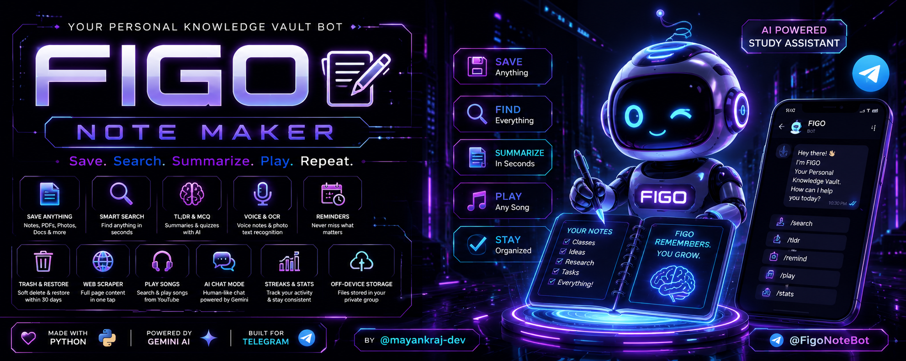

<div align="center">



# 𝐅ɪɢᴏ 📖

### Your Personal Knowledge Vault Bot

**Save. Search. Summarize. Organize. Study. Play. Repeat.**

<a href="https://t.me/FigoNoteBot"></a>
<a href="https://github.com/mayankraj-dev"></a>

<br>

`🐍 Python` `🤖 Telegram` `🧠 Gemini` `💾 SQLite` `⚡ Async`

**📥 Save anything • 🔎 Find everything • 🧠 Study smarter • ⏰ Remember more • 🎵 Play music • 🧬 Clone FIGO**

</div>

---

# 🧠 What is FIGO?

**FIGO** is a Telegram-based personal knowledge vault built around one simple idea:

> **If you can send it to Telegram, FIGO can help you keep it useful.**

Send notes, links, PDFs, Word documents, PowerPoints, webpages, code/text files or photos. FIGO can save them to your private vault, extract searchable text, organize them, find related content and turn them into summaries, explanations and quizzes.

And it goes beyond notes: reminders, daily/weekly digests, streaks, AI chat, inline search, music playback, exports, trash recovery, private off-device media storage, activity logs, automatic changelog announcements and a built-in bot cloning system.

---

# ⚡ Feature Universe

| Module | What FIGO does |
|---|---|
| 📥 **Universal Saving** | Save text, links, files and photos |
| 🔗 **Full-page Scraper** | Fetch and index page content from URLs |
| 📄 **File Extraction** | PDF, DOCX, PPTX, HTML, PY, MD, TXT, JSON, CSV and more |
| 📸 **OCR** | Extract text from photos when OCR dependencies are available |
| 🔎 **Smart Search** | Full-text search with close-word matching |
| 🔗 **Related Notes** | Find related content from your own vault |
| 🧠 **TL;DR** | Generate concise summaries |
| ❓ **Ask** | Ask questions about a saved item |
| ✍️ **Rewrite** | Turn messy notes into cleaner structured notes |
| 💡 **Explain** | Explain saved content in simpler language |
| 📝 **MCQ Generator** | Generate quizzes from saved material |
| 🏷️ **Auto Tags** | Detect common topics automatically |
| 📌 **Pins** | Keep important items easy to find |
| 🚦 **Priorities** | Low / Medium / High / Critical |
| 📁 **Collections** | Build named groups of vault items |
| ⏰ **Reminders** | Schedule item-specific reminders |
| 🗞️ **Digests** | Daily or weekly summaries of recent saves |
| 🔥 **Streaks** | Track consistent saving activity |
| 🗑️ **Trash & Restore** | Soft-delete with 30-day recovery |
| 📦 **Exports** | TXT, Markdown or JSON |
| 💬 **AI Chat Mode** | Human-like Gemini-powered conversation |
| 🎵 **Music** | Search YouTube and send audio |
| ⚡ **Inline Search** | Search your vault from Telegram inline mode |
| ☁️ **Off-device Storage** | Archive PDFs/photos in a private Telegram group |
| 📡 **Activity Logs** | Live operational events |
| 📣 **Announcements** | Automatic numbered changelog cards |
| 🧬 **Bot Cloning** | Separate personal FIGO instances |
| 👑 **Admin Mode** | Maintenance, users, clones and announcements |
| 🖥️ **Runtime Tools** | Ping, uptime, owner and chat-ID helpers |

---

# 📥 Save Anything

### Just send it

```text
A random study note...
```

FIGO saves it.

### Send a URL

```text
https://example.com/article
```

FIGO fetches the page, extracts its content and indexes it.

### Send files

```text
📄 lecture.pdf
📄 assignment.docx
📊 presentation.pptx
💻 code.py
📝 notes.md
📋 data.csv
```

Supported text extraction covers PDF, DOCX, PPTX, HTML and common code/text formats. Unknown extensions can still be stored even when their text cannot be extracted.

### Send a photo

When OCR is available, FIGO automatically attempts to extract text from photos.

> **Privacy rule:** in groups, FIGO does not automatically save text, links, files or photos. Group content requires an explicit `/note` action.

---

# 🔎 Find Everything

```text
/search <keywords>
```

Search your vault with full-text matching and close word variants.

```text
/view <id>
```

Open a saved item and discover related notes.

```text
/list
```

Show recent items.

```text
/random
```

Pull a random item.

```text
/stats
```

See counts by saved type.

---

# 🏷️ Organize Your Brain

### Tags

```text
/tag 12 programming
/tagged programming
```

Some topic tags can also be detected automatically when content is saved.

### Pins

```text
/pin 12
/pinned
```

### Priorities

```text
/priority 12 critical
/priorities
/priorities high
```

Levels:

```text
🟢 low
🟡 medium
🟠 high
🔴 critical
```

### Collections

```text
/collection create College
/collection add 12 College
/collection view College
/collection list
/collection remove 12 College
/collection delete College
```

Collections let you group vault items without duplicating their content.

---

# 🧠 AI Study Lab

## TL;DR

```text
/tldr 12
```

Generate a short summary of a saved item.

## Ask

```text
/ask 12 What are the three main ideas?
```

Ask Gemini about one saved item. This requires `GEMINI_API_KEY`.

## Rewrite

```text
/rewrite 12
```

Turn messy material into a cleaner structured note.

## Explain

```text
/explain 12
```

Explain saved content in simpler language.

`/rewrite` and `/explain` can fall back to a simpler local result when Gemini is unavailable.

## MCQs

```text
/mcq 12
/mcq 12 10
```

Default: **5 questions** • Maximum: **10 questions**

FIGO can generate quiz questions from saved study material, with a local fallback when configured AI is unavailable.

---

# ⏰ Reminders • Digests • Streaks

```text
/remind 12 tomorrow 9am
/remind 12 in 2h
/remind 12 today 18:00
```

FIGO runs background workers that check due reminders.

### Digests

```text
/digest
/digest daily 08:00
/digest weekly 08:00
/digest off
```

Daily and weekly digests summarize recently saved items.

### Streaks

```text
/streak
```

Track your saving consistency.

---

# 🗑️ Trash Without Panic

FIGO uses soft deletion instead of immediately destroying active items.

```text
/clear 5
```

Move the oldest 5 active items to trash.

```text
/clearall confirm
```

Move everything active to trash.

```text
/trash
```

View deleted items and their expiry dates.

```text
/restore 12
```

Restore a trashed item.

### ⏳ Recovery window

**30 days** before expired trash is permanently purged.

---

# 📦 Your Data, Your Export

Export your active vault:

```text
/export txt
/export md
/export json
```

Exports contain item IDs, types, titles, content, tags and creation dates.

The temporary export file is removed from disk after it is sent.

---

# 💬 AI Chat Mode

Switch FIGO into conversational mode:

```text
/chat on
```

Normal text becomes chatbot conversation instead of automatic note saving.

Turn it off:

```text
/chat off
```

Still want to save something?

```text
/note This belongs in my vault.
```

Chat history is kept per user and bounded to a recent window.

---

# 🎵 Music Mode

Search YouTube and send audio:

```text
/play song name
```

Flow:

```text
🔎 Search
   ↓
🎵 Pick result
   ↓
⬇️ Temporary download
   ↓
📤 Send audio
   ↓
🧹 Delete temporary file
```

Requires `yt-dlp` and `ffmpeg`.

FIGO limits requested tracks to 20 minutes and cleans up temporary audio after delivery.

---

# ⚡ Inline Search

Use FIGO from Telegram inline mode:

```text
@FigoNoteBot your search
```

Inline results are generated from the authenticated user's own vault.

---

# ☁️ Off-Device Storage

Configure a private Telegram group:

```env
FIGO_STORAGE_CHAT_ID=-100xxxxxxxxxx
```

FIGO can archive PDFs/photos there instead of relying entirely on local disk and retrieve them on demand through Telegram.

Find a chat ID:

```text
/chatid
```

For a group, FIGO also prints the environment-variable format needed for storage.

---

# 📡 Live Activity Logs

With storage logging enabled, FIGO can post important runtime events into the storage group:

```text
🚀 FIGO started
👤 New user
📝 Note saved
📸 Photo saved
📄 File saved
🎵 Song downloaded
📤 File sent
🧬 Clone spawned
```

The same private group can therefore act as a lightweight operational dashboard.

---

# 📣 Automatic Changelog Channel

Configure:

```env
FIGO_ANNOUNCE_CHAT_ID=-100xxxxxxxxxx
```

and make FIGO an admin of the target channel.

On startup, FIGO compares its built-in changelog with the last announced update and posts new update cards containing what changed and how to use it.

This gives the project a live:

```text
VERSION → CHANGELOG → TELEGRAM ANNOUNCEMENT
```

pipeline.

---

# 🧬 Clone Your Own FIGO

FIGO can launch separate personal instances for users.

In a **private chat only**:

```text
/clone <bot_token>
```

The bot verifies the token with Telegram and creates an independent instance with:

- 🗄️ Separate database
- 📁 Separate files
- 🧑‍💻 Separate owner
- ☁️ Separate storage configuration
- 📣 Separate announcement configuration
- 🟢 Independent process

Check it:

```text
/myclone
```

Stop it:

```text
/unclone
```

Main-bot admin controls:

```text
/clones
/startclone <id|owner_id|bot_username>
/stopclone <id|owner_id|bot_username>
/delclone <id|owner_id|bot_username>
```

> 🔐 **Never send a bot token in a group, GitHub issue, commit or screenshot. Use private chat only.**

---

# 👑 Admin Center

The configured admin can use:

```text
/admin
```

Runtime:

```text
/status
/users
/on
/off
```

Clone management:

```text
/clones
/startclone <id|owner_id|bot_username>
/stopclone <id|owner_id|bot_username>
/delclone <id|owner_id|bot_username>
```

Announcements:

```text
/announce <message>
```

Maintenance mode can pause FIGO for everyone except the admin.

---

# 📖 Topic-Based Help

Instead of one huge command wall:

```text
/help
```

opens the help hub.

Focused sections:

```text
/hsave
/hfind
/horganize
/hstudy
/hremind
/hsafety
/hexport
/hchat
/hsystem
/hclone
/hadmin
```

---

# 🧩 Complete Command Map

<details>
<summary>📥 Save & Find</summary>

```text
/start
/help
/note <text>
/search <keywords>
/view <id>
/list
/random
/stats
```

</details>

<details>
<summary>🏷️ Organize</summary>

```text
/tag <id> <label>
/tagged <label>
/pin <id>
/pinned
/priority <id> <low|medium|high|critical>
/priorities [level]

/collection create <name>
/collection add <id> <name>
/collection remove <id> <name>
/collection view <name>
/collection list
/collection delete <name>
```

</details>

<details>
<summary>🧠 AI & Study</summary>

```text
/tldr <id>
/mcq <id> [count]
/ask <id> <question>
/rewrite <id>
/explain <id>
/chat on
/chat off
```

</details>

<details>
<summary>⏰ Productivity</summary>

```text
/remind <id> <when>
/digest
/digest daily 08:00
/digest weekly 08:00
/digest off
/streak
```

</details>

<details>
<summary>🗑️ Safety & Data</summary>

```text
/clear <n>
/clearall confirm
/trash
/restore <id>
/export txt
/export md
/export json
```

</details>

<details>
<summary>🎵 Media & Utilities</summary>

```text
/play <song>
/ping
/uptime
/owner
/chatid
```

</details>

<details>
<summary>🧬 Cloning</summary>

```text
/clone <bot_token>
/myclone
/unclone
```

</details>

<details>
<summary>👑 Admin</summary>

```text
/admin
/status
/users
/on
/off
/clones
/startclone <id|owner_id|bot_username>
/stopclone <id|owner_id|bot_username>
/delclone <id|owner_id|bot_username>
/announce <message>
```

</details>

---

# 🏗️ Architecture

```text
                         ┌─────────────────────┐
                         │      TELEGRAM       │
                         │ Users / Groups /    │
                         │ Channels / Inline   │
                         └──────────┬──────────┘
                                    │
                                    ▼
                       ┌────────────────────────┐
                       │       FIGO BOT         │
                       │ Python + PTB + Async   │
                       └───────────┬────────────┘
                                   │
            ┌──────────────────────┼──────────────────────┐
            ▼                      ▼                      ▼
     ┌──────────────┐       ┌──────────────┐       ┌──────────────┐
     │    SQLite    │       │   AI Layer   │       │ Media Layer  │
     │ Vault        │       │ Gemini       │       │ Telegram     │
     │ Users        │       │ TL;DR        │       │ Storage      │
     │ Reminders    │       │ MCQ          │       │ OCR          │
     │ Collections  │       │ Ask/Rewrite  │       │ Music        │
     │ Clones       │       │ Explain      │       │ Files        │
     └──────────────┘       └──────────────┘       └──────────────┘
                                   │
                         ┌─────────┴─────────┐
                         ▼                   ▼
                  ┌──────────────┐    ┌──────────────┐
                  │   YouTube    │    │ Web / URLs   │
                  │   yt-dlp     │    │ Page scraper │
                  └──────────────┘    └──────────────┘
```

---

# 🧰 Tech Stack

| Layer | Technology |
|---|---|
| 🤖 Bot Framework | `python-telegram-bot` |
| 🐍 Language | Python |
| 🧠 AI | Gemini API |
| 💾 Database | SQLite |
| 🌐 HTTP | `requests` |
| 📄 PDF | `pypdf` |
| 🌍 HTML | `BeautifulSoup4` |
| 👁️ OCR | `pytesseract` + `Pillow` + Tesseract |
| 🎵 Music | `yt-dlp` + `ffmpeg` |
| ☁️ Remote Storage | Telegram private group |
| 📡 Runtime | Async polling + background workers |

---

# ⚙️ Self-Hosting

## 1. Clone

```bash
git clone <YOUR_FIGO_REPOSITORY_URL>
cd <YOUR_FIGO_REPOSITORY>
```

## 2. Install Python dependencies

```bash
pip install python-telegram-bot requests pypdf beautifulsoup4 pytesseract Pillow yt-dlp
```

Install `ffmpeg` separately for `/play`.

Install the Tesseract executable for OCR.

## 3. Configure environment

Required:

```env
BOT_TOKEN=your_telegram_bot_token
```

Optional:

```env
GEMINI_API_KEY=your_gemini_api_key
FIGO_BOT_USERNAME=FigoNoteBot
FIGO_OCR=1
FIGO_STORAGE_CHAT_ID=-100xxxxxxxxxx
FIGO_ANNOUNCE_CHAT_ID=-100xxxxxxxxxx
FIGO_FILES_DIR=files
FIGO_CLONES_DIR=clones
FIGO_IS_CLONE=0
```

## 4. Run

```bash
python figobot.py
```

---

# 🔐 Configuration Reference

| Variable | Required | Purpose |
|---|:---:|---|
| `BOT_TOKEN` | ✅ | Telegram Bot API token |
| `GEMINI_API_KEY` | ❌ | AI summaries, MCQs, ask, chat and study tools |
| `FIGO_BOT_USERNAME` | ❌ | Bot username for inline/help links |
| `FIGO_OCR` | ❌ | Enable/disable OCR |
| `FIGO_STORAGE_CHAT_ID` | ❌ | Private Telegram group for media storage/logs |
| `FIGO_ANNOUNCE_CHAT_ID` | ❌ | Channel for automatic changelog posts |
| `FIGO_FILES_DIR` | ❌ | Local files directory override |
| `FIGO_CLONES_DIR` | ❌ | Clone instances directory |
| `FIGO_IS_CLONE` | ❌ | Marks a process as a FIGO clone |

---

# 📁 Recommended Repository

```text
Figo-Note-Maker/
│
├── assets/
│   ├── figo-banner.png
│   └── screenshots/
│
├── figobot.py
├── README.md
├── requirements.txt
├── .env.example
├── .gitignore
│
├── figo.db              # generated — DO NOT COMMIT
├── files/               # runtime data
├── tmp_music/           # temporary audio
└── clones/              # generated clone instances
```

### 🚫 Keep these out of Git

```text
.env
figo.db
files/
tmp_music/
clones/
*.log
bot tokens
API keys
```

---

# 🧪 Minimal requirements.txt

```txt
python-telegram-bot
requests
pypdf
beautifulsoup4
pytesseract
Pillow
yt-dlp
```

System-level:

```text
ffmpeg
Tesseract OCR
```

---

# 🔄 Data Flow

```text
USER SENDS CONTENT
       │
       ├── TEXT ──────────────┐
       ├── LINK → SCRAPER ────┤
       ├── FILE → EXTRACTOR ──┤
       └── PHOTO → OCR ───────┤
                              ▼
                       NORMALIZE CONTENT
                              │
                              ▼
                       DUPLICATE CHECK
                              │
                              ▼
                       AUTO-TAG + SAVE
                              │
                              ▼
                         SQLITE VAULT
                              │
             ┌────────────────┼────────────────┐
             ▼                ▼                ▼
          SEARCH            STUDY           REMIND
             │                │                │
             ▼         ┌──────┼──────┐         ▼
          /search     /tldr  /mcq  /ask      /remind
                     /rewrite /explain
```

---

# 🧭 FIGO Philosophy

Most note bots stop at:

> **“Store this.”**

FIGO asks:

> **“What can we do with what you stored?”**

```text
SAVE
 ↓
ORGANIZE
 ↓
UNDERSTAND
 ↓
REMEMBER
 ↓
USE
```

A lecture can become a searchable note.  
A note can become a summary.  
A summary can become a quiz.  
A quiz can become revision.  
And a reminder can bring it back when you need it.

---

# 🗺️ Roadmap

### 📚 Knowledge
- [x] Universal note saving
- [x] File extraction
- [x] Full-page URL scraping
- [x] OCR
- [x] Smart search
- [x] Related notes
- [x] Tags
- [x] Collections
- [x] Priorities
- [x] Pins

### 🧠 AI
- [x] TL;DR
- [x] MCQ generation
- [x] Ask questions
- [x] Rewrite notes
- [x] Explain content
- [x] Chat mode

### ⏰ Productivity
- [x] Reminders
- [x] Daily digest
- [x] Weekly digest
- [x] Streak tracking
- [x] Trash & restore
- [x] TXT/MD/JSON exports

### 🛰️ Infrastructure
- [x] Private media storage
- [x] Activity logs
- [x] Announcement channel
- [x] Admin maintenance mode
- [x] Clone management
- [x] Inline search

---

# 🤝 Contributing

```bash
git checkout -b feature/my-awesome-feature
```

Then:

1. Make your changes
2. Test locally
3. Keep user data isolated
4. Never commit secrets
5. Open a Pull Request

Ideas, bug reports and improvements are welcome.

---

# 👑 Credits

<div align="center">

### Built by

**Mayank — @tg4mayank**

### Telegram

**@FigoNoteBot**

<br>

Made with:

`🐍 Python` + `🤖 Telegram` + `🧠 Gemini` + `💾 SQLite` + `⚡ caffeine`

</div>

---

# ⚠️ Important

- FIGO depends on Telegram and optional external services.
- AI summaries, explanations and quizzes may contain mistakes.
- Music functionality requires `yt-dlp` and `ffmpeg` and should be used in accordance with applicable rights and platform terms.
- Never expose your Telegram bot token or Gemini API key.
- Never send bot tokens to FIGO in a group.
- Keep storage and announcement groups private and appropriately permissioned.
- Do not commit generated databases, runtime media, clone files or secrets.

---

<div align="center">

# 𝐅ɪɢᴏ 📖

### Your knowledge deserves a home.

**Save it. Find it. Understand it. Remember it.**

<br>

<a href="https://t.me/FigoNoteBot"></a>

<br><br>

⭐ **Star the repository if FIGO is useful to you.**

</div>
